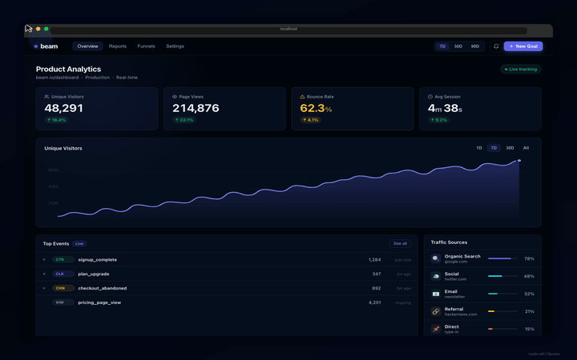

[English](./README.md) | [한국어](./README.ko.md)

# Clipwise

YAML 시나리오를 작성하면 시네마틱 데모 영상(MP4/GIF)을 자동으로 만들어주는 스크린 레코더. Playwright CDP 기반.

<p align="center">
  
</p>

> *`npx clipwise demo` 한 줄로 생성된 영상입니다 — YAML 파일 1개, 239줄.*

## 빠른 시작

```bash
# 설치
npm install -D clipwise

# 내장 데모 즉시 실행
npx clipwise demo

# 또는 직접 시나리오 작성
npx clipwise init                              # clipwise.yaml 템플릿 생성
# clipwise.yaml 편집 — URL을 내 사이트로 변경
npx clipwise record clipwise.yaml -f mp4       # 녹화!
```

## 요구사항

- **Node.js** >= 18
- **ffmpeg** (MP4 출력용)
- **Chromium** (첫 실행 시 Playwright가 자동 설치)

```bash
# macOS
brew install ffmpeg

# Ubuntu
sudo apt install ffmpeg

# Windows
choco install ffmpeg
```

## 사용법

### CLI 명령어

```bash
# 즉시 데모 — 내장 대시보드 녹화
npx clipwise demo                          # 브라우저 프레임, MP4
npx clipwise demo --device iphone          # iPhone 목업
npx clipwise demo --device android         # Android 목업
npx clipwise demo --device ipad            # iPad 목업
npx clipwise demo --url https://my-app.com # 내 사이트 데모

# YAML 시나리오로 녹화
npx clipwise record <scenario.yaml> -f mp4 -o ./output
npx clipwise record <scenario.yaml> -f gif -o ./output

# 템플릿 초기화
npx clipwise init

# 녹화 없이 검증만
npx clipwise validate <scenario.yaml>
```

### 프로그래밍 API

```typescript
import { ClipwiseRecorder, CanvasRenderer, encodeMp4, loadScenario } from "clipwise";

const scenario = await loadScenario("my-scenario.yaml");
const recorder = new ClipwiseRecorder();
const session = await recorder.record(scenario);

const renderer = new CanvasRenderer(scenario.effects, scenario.output, scenario.steps);
const frames = await renderer.composeAll(session.frames);

const mp4 = await encodeMp4(frames, scenario.output);
```

## YAML 시나리오 형식

시나리오는 4개 섹션으로 구성됩니다: 메타데이터, 이펙트, 출력, 스텝.

```yaml
name: "My Demo"
description: "선택 설명"

viewport:
  width: 1280    # 브라우저 너비 (기본: 1280)
  height: 800    # 브라우저 높이 (기본: 800)

effects:
  # 아래 "이펙트" 섹션 참조

output:
  format: mp4              # gif | mp4 | png-sequence
  width: 1280
  height: 800
  fps: 30                  # 1-60
  preset: social           # social | balanced | archive

steps:
  - name: "스텝 이름"
    actions:
      - action: navigate
        url: "https://example.com"
    captureDelay: 200       # 액션 후 대기(ms)
    holdDuration: 800       # 결과 화면 유지(ms)
    transition: none        # none | fade
```

### 액션

#### 기본 액션

| 액션 | 파라미터 | 기본값 | 설명 |
|------|---------|--------|------|
| `navigate` | `url`, `waitUntil?` | `waitUntil: "networkidle"` | URL로 이동 |
| `click` | `selector`, `delay?`, `timeout?` | | 요소 클릭 |
| `type` | `selector`, `text`, `delay?`, `timeout?` | `delay: 50` | 텍스트 입력 (한 글자씩) |
| `hover` | `selector`, `timeout?` | | 요소에 마우스 올리기 |
| `scroll` | `y?`, `x?`, `selector?`, `smooth?`, `timeout?` | `y: 0`, `x: 0`, `smooth: true` | 스크롤 |
| `wait` | `duration` | | 대기 (ms) |
| `screenshot` | `name?`, `fullPage?` | `fullPage: false` | 캡처 마커 |

#### 비동기 대기 액션

| 액션 | 파라미터 | 기본값 | 설명 |
|------|---------|--------|------|
| `waitForSelector` | `selector`, `state?`, `timeout?` | `state: "visible"`, `timeout: 15000` | 요소 상태 대기 |
| `waitForNavigation` | `waitUntil?`, `timeout?` | `waitUntil: "networkidle"`, `timeout: 15000` | 페이지 로드 대기 |
| `waitForURL` | `url`, `timeout?` | `timeout: 15000` | URL 매칭 대기 |
| `waitForFunction` | `expression`, `polling?`, `timeout?` | `polling: "raf"`, `timeout: 30000` | JS 표현식이 truthy가 될 때까지 대기 |
| `waitForResponse` | `url`, `status?`, `timeout?` | `timeout: 30000` | 네트워크 응답 대기 (URL 부분 문자열 매칭) |

**`waitUntil`** 옵션: `"load"`, `"domcontentloaded"`, `"networkidle"` (기본)
**`state`** 옵션: `"visible"` (기본), `"attached"`, `"hidden"`
**`polling`** 옵션: `"raf"` (requestAnimationFrame, 기본) 또는 밀리초 숫자 (예: `500`)

#### 비동기 대기 예시

```yaml
# 요소가 나타날 때까지 대기
- action: waitForSelector
  selector: ".result-panel"
  state: visible
  timeout: 20000

# AI 스트리밍 응답 완료 대기
- action: waitForFunction
  expression: "document.querySelector('.ai-response')?.dataset.done === 'true'"
  timeout: 60000

# API 응답 완료 대기
- action: waitForResponse
  url: "/api/chat/completions"
  status: 200
  timeout: 60000

# 동적 콘텐츠 길이 대기
- action: waitForFunction
  expression: "document.querySelector('.output')?.textContent?.length > 100"
  polling: 500
```

### 타이밍 팁

빠른 데모 (~30초):
- `captureDelay: 50-100` ms
- `holdDuration: 500-800` ms
- `type.delay: 15-25` ms/글자

느린 시네마틱:
- `captureDelay: 200-400` ms
- `holdDuration: 1500-2500` ms
- `type.delay: 40-60` ms/글자

## 이펙트

모든 이펙트는 선택사항이며 합리적인 기본값이 있습니다.

### 줌

적응형 줌 — 커서를 따라가며 클릭 대상에 자동 줌인. 강도 프리셋 또는 숫자 스케일로 설정.

```yaml
zoom:
  enabled: true
  intensity: moderate  # subtle | light | moderate | strong | dramatic
                       # 1.15x  | 1.25x | 1.35x    | 1.5x   | 1.8x
  # scale: 1.35       # 숫자로 직접 지정할 때 사용 (intensity 미설정 시)
  duration: 500        # 애니메이션 ms
```

| 강도 | 스케일 | 권장 사용처 |
|------|--------|------------|
| `subtle` | 1.15× | 정보 밀도 높은 UI, 큰 화면 |
| `light` | 1.25× | Loom 스타일 부드러운 줌 (권장) |
| `moderate` | 1.35× | 균형잡힌 기본값 (Camtasia 수준) |
| `strong` | 1.5× | 명확한 포커스 |
| `dramatic` | 1.8× | 최대 강조, 단순 UI 전용 |

### 커서

커스텀 커서 + 클릭 리플 + 트레일 + 하이라이트 + 속도 조절.

```yaml
cursor:
  enabled: true
  size: 20
  speed: "fast"        # fast (~72ms) | normal (~144ms) | slow (~288ms)
  clickEffect: true
  trail: true
  highlight: true
```

### 배경

그라디언트/단색 패딩 + 라운드 코너 + 그림자.

```yaml
background:
  type: gradient
  value: "linear-gradient(135deg, #667eea 0%, #764ba2 100%)"
  padding: 48
  borderRadius: 14
  shadow: true
```

### 디바이스 프레임

녹화를 디바이스 목업으로 감싸기.

```yaml
deviceFrame:
  enabled: true
  type: browser          # browser | iphone | ipad | android | none
  darkMode: true
```

| 타입 | 설명 |
|------|------|
| `browser` | macOS 브라우저 크롬 (신호등 버튼) |
| `iphone` | iPhone 15 Pro (Dynamic Island + 홈바) |
| `ipad` | iPad Pro (전면 카메라) |
| `android` | Android (펀치홀 카메라) |

### 키스트로크 HUD

화면 하단에 타이핑 내용을 표시하는 HUD. 기본값은 수정키+단축키만 표시 (Screen Studio, KeyCastr, ScreenFlow 등 업계 표준). `showTyping: true`로 일반 타이핑 내용도 표시 가능.

여러 입력 필드에 걸쳐 입력할 때는 각 필드가 별도 줄로 표시됩니다 (최대 3줄, 오래된 줄은 흐리게).

```yaml
keystroke:
  enabled: true
  showTyping: true       # 타이핑 내용 표시 (기본값: false — 단축키만)
  position: bottom-center
  fontSize: 16
  fadeAfter: 1500
```

### 워터마크

코너에 텍스트 오버레이.

```yaml
watermark:
  enabled: true
  text: "Clipwise"
  position: bottom-right
  opacity: 0.5
```

### 속도 램프

클릭 근처 슬로우모션, 유휴 구간 빨리감기.

```yaml
speedRamp:
  enabled: true
  idleSpeed: 3.0
  actionSpeed: 0.8
```

## 성능

**Apple M1 Max (10코어)** 기준 — Pulse Dashboard 데모, 44초 @ 30fps, 1280×800:

| 단계 | v0.3.0 | v0.4.0 | v0.5.0 |
|------|--------|--------|--------|
| 녹화 | 30.8 s | 31.1 s | 31.1 s |
| 합성 + 인코딩 | 97.2 s | 60.6 s | 60.6 s |
| **전체** | **127.9 s** | **91.7 s** | **91.7 s** |
| 캡처 프레임 수 | 1,303 | 902 | 902 |

v0.4.0 주요 최적화: 동시 스트리밍 파이프라인, 정적 프레임 중복 제거(~33% 건너뜀), 워커별 StaticLayers 캐시, raw RGBA 버퍼 파이프라인.

v0.5.0은 **녹화 품질** 개선에 집중: CSS 트랜지션 억제로 커서 부드러운 이동, 줌 강도 프리셋, 멀티세션 키스트로크 HUD.

## 출력 압축

`preset` 필드로 화질과 파일 크기를 조절합니다:

```yaml
output:
  format: mp4
  fps: 30
  preset: social      # social | balanced | archive
```

| 프리셋 | libx264 CRF | HEVC VideoToolbox q:v | 용도 |
|--------|-------------|----------------------|------|
| `social` | 22 | 60 | Twitter, LinkedIn 등 소셜 공유 (~2-4 MB / 30초) |
| `balanced` | 18 | 70 | 범용, 포트폴리오 (~4-6 MB / 30초) |
| `archive` | 13 | 80 | 고화질 보관, 소스 마스터 (무제한) |

**권장**: 대부분의 데모에는 `preset: balanced`.

> **레거시**: `quality: 1-100`은 계속 작동하며 가장 가까운 프리셋으로 매핑됩니다 (`>= 75` → social, `>= 45` → balanced, `< 45` → archive). 명확성을 위해 `preset` 사용을 권장합니다.

### macOS — 하드웨어 가속

**Apple Silicon 및 Intel Mac**에서 Clipwise는 자동으로 `hevc_videotoolbox` (HEVC/H.265) 하드웨어 인코더를 사용합니다. 별도 설정 없이 소프트웨어 인코딩 대비 **~5–10× 빠른 인코딩** 속도를 제공합니다.

```
macOS (HEVC VideoToolbox)  →  44초짜리 1280×800 데모 기준 약 3분
Linux / Windows            →  동일 품질 기준 약 8–12분 (libx264)
```

VideoToolbox는 런타임에 자동 감지되며, 사용 불가 시 `libx264`로 자동 폴백합니다.

## AI로 시나리오 작성

[PROMPTS.md](./PROMPTS.md)에 바로 사용할 수 있는 AI 프롬프트 템플릿이 있습니다. ChatGPT나 Claude에 복붙하고 내 사이트 URL만 넣으면 YAML 시나리오를 생성해줍니다.

## GitHub Pages

`docs/` 폴더에 문서 사이트와 라이브 데모 대시보드가 포함되어 있습니다:

1. GitHub에 push: `git push origin main`
2. **Settings > Pages** > source: `main`, folder: `/docs`
3. 문서: `https://username.github.io/clipwise/`
4. 데모: `https://username.github.io/clipwise/demo/`

## 보안

- **셀렉터 검증**: YAML의 CSS 셀렉터는 안전한 문자만 허용
- **URL 처리**: `http://`, `https://`, `file://` 스키마만 허용
- **Chromium 샌드박스**: Playwright 기본 샌드박싱 적용
- **로컬 처리**: 녹화 프레임은 절대 외부로 전송되지 않음

## 개발

```bash
npm install          # 의존성 설치
npm run build        # tsup으로 빌드
npm run typecheck    # 타입 체크
npm test             # 테스트 (vitest)
```

## 라이선스

MIT
